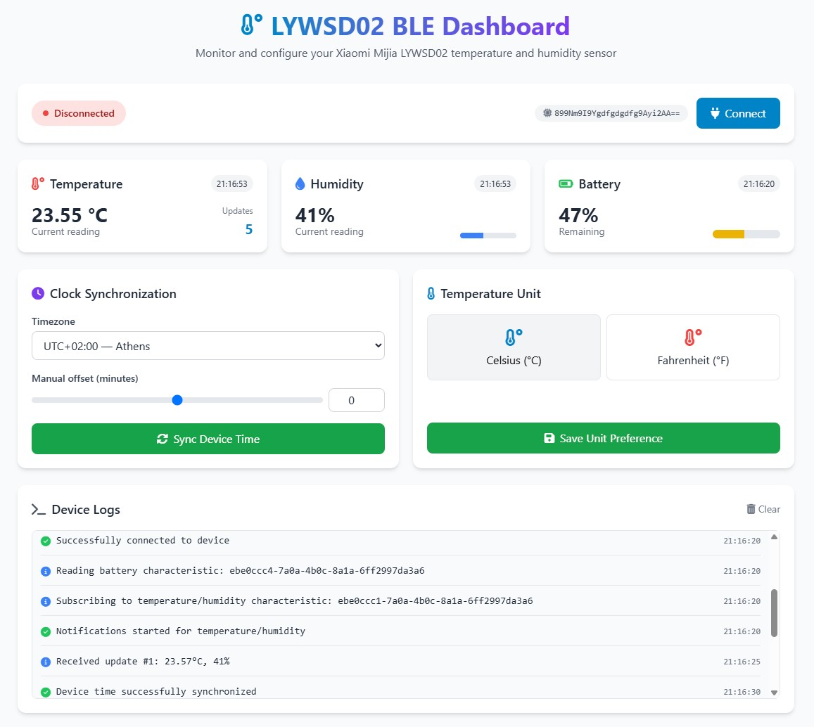

# LYWSD02 BLE Dashboard

A modern web interface to monitor and configure your Xiaomi Mijia LYWSD02 temperature and humidity sensor via Bluetooth Low Energy (BLE).

---

## Overview

**LYWSD02 BLE Dashboard** allows you to:
- Display real-time temperature, humidity, and battery levels.
- Synchronize the device time with your local time zone.
- Choose the temperature unit (°C or °F).
- View detailed logs of device interactions.

---

## Demo

Visit the live demo at: [https://drslid.github.io/LYWSD02-BLE-Dashboard/](https://drslid.github.io/LYWSD02-BLE-Dashboard/)

---

## Usage

- **Connect:** Click the **Connect** button to search for and connect to your sensor.
- **Sync Time:** Use the **Sync Device Time** button to update the sensor's time.
- **Configuration:** Select your preferred temperature unit and save your choice.
- **Logs:** Monitor device interactions in the **Device Logs** section.

---

## Contribution

Contributions are welcome!  
To propose improvements or fix bugs, open an [issue](https://github.com/drslid/LYWSD02-BLE-Dashboard/issues) or submit a pull request.

---

## License

Distributed under the [MIT License](LICENSE). See the `LICENSE` file for details.

---

## Author

**drslid** – [GitHub](https://github.com/drslid)
